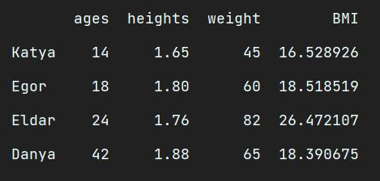

# Data_Science


This **repository** is a cheat sheet how to make various **diograms**, **histograms**, **line**, **bar** or even **pie charts**.

Also, we will see a various of **destributions**, like **binomial**, **exponential**, **normal** etc.
___

## *Files_location*

+ :file_folder: Dio_Histo_grams
  + Bar_Chart.png
  + Double_Bar_Chart.png
  + Histogram.png
  + Pie_Chart.png
  + Range_Diagram.png
  + Scatter-plot.png
+ :file_folder: Line_Charts
  + Double_Area_Chart.png
  + Double_Line_Chart.png
  + Line_Chart.png
+ :file_folder: distribution
  + Binomial_Distribution.png
  + Chi_Square_Distribution.png
  + Exponential_Distribution.png
  + Logistic_Distribution.png
  + Multinomial_Distribution.png
  + Normal_Distribution.png
  + Pareto_Distribution.png
  + Poisson_Distribution.png
  + Rayleigh_Distribution.png
  + Uniform_Distribution.png
  + Zipf_Distribution.png
+ Matplot.py
+ Numpy.py
+ Numpy_random.py
+ Pandas.py
+ Seaborn.py
+ main.py
___

## ***Usage***

### *Pandas*
Start with [Pandas library](https://pandas.pydata.org). **Pandas** is a fast, powerful, flexible and easy to use open source data analysis and manipulation tool, built on top of the Python programming language.

First of all, import [pandas](https://pandas.pydata.org/getting_started.html) in our programm.
```python
import pandas as pd
```
### *Pandas Example*

Create a new Table Data Frame with our index by using parameter *"index"* in the DataFrame function. 
```python
# create Table Data Frame
data = {
    'table_data': {
        'ages': [14, 18, 24, 42],
        'heights': [1.65, 1.80, 1.76, 1.88],
        'weight': [45, 60, 82, 65]
    },
    'index_data': ['Katya', 'Egor', 'Eldar', 'Danya']
}
df = pd.DataFrame(data['table_data'], index=data['index_data'])
```

Also, we can **add a new column** in our table like this:
```python
# add a new column (Series)
df['BMI'] = df['weight'] / (df['heights']**2)
```

And finally, print the result to the console:
```python
# get all table
print(f'{df}\n')
```



It's all just a part of this library. There are a lot of commands like **slices the table**, **conditionals**, **grouping**, get **count**, **mean**, **std**, **min**, **max** values and so on.
___

### *Matplotlib*

Second important library is [Matplotlib](https://matplotlib.org). **Matplotlib** is a comprehensive library for creating static, animated, and interactive visualizations in Python.

First of all, import [matplotlib.pyplot](https://matplotlib.org/stable/tutorials/introductory/pyplot.html) and [pandas](https://pandas.pydata.org/getting_started.html) in our programm.
```python
import matplotlib.pyplot as plt
import pandas as pd
```
### *Matplotlib Example*

Then make some information statistic and save it in a dictionary data type.
```python
data = {
    'cases': [130, 140, 148, 160, 165, 172, 177],
    'deaths': [10, 20, 30, 30, 35, 60, 55],
    'months': ['January', 'February', 'March', 'April', 'May', 'June', 'July'],

}
```

After that, we will make **table** using library **pandas**. And make index by **'months'** in our table.
```python
df = pd.DataFrame(data, index=data['months'])
```

This is example of **Double Line Chart**:  
```python
# make 2 lines - "cases" and "deaths"
df[['cases', 'deaths']].plot(kind="line", legend=True, color=['#000000', '#FF0000'])

plt.xlabel('Year')  # X axis
plt.ylabel('Number')  # Y axis

plt.suptitle("Death Statistic")  # create title

# save visualization in the folder
plt.savefig('Line_Charts/Double_Line_Chart.png')
```

As the result, we will have this visualization:


In addition, with Matplotlib we can make *bar charts* :bar_chart:, *double bar charts*, *histograms*, *pie charts*, *range diagrams*, varieties of *line charts* :chart_with_upwards_trend: :chart_with_downwards_trend: etc. 
___

### *Seaborn*

And of course, the really cool visualization library is [Seaborn](https://seaborn.pydata.org). **Seaborn** is a Python data visualization library based on matplotlib. It provides a high-level interface for drawing attractive and informative statistical graphics.

let`s import [seaborn](https://seaborn.pydata.org/installing.html), [numpy.random](https://numpy.org/doc/stable/reference/random/index.html) and [matplotlib.pyplot](https://matplotlib.org/stable/tutorials/introductory/pyplot.html) in our programm.
```python
import seaborn as sns
from numpy import random
import matplotlib.pyplot as plt
```

### *Seaborn Example*

With these libraries we will make visualization of different distributions.

As for example, we will make distributions of dice rolling.

We will use three parameters:

n - number of possible outcomes (e.g. 6 for dice roll).

pvals - list of probabilties of outcomes (e.g. [1/6, 1/6, 1/6, 1/6, 1/6, 1/6] for dice roll).

size - The shape of the returned array.

```python
# Visualization of Multinomial Distribution
sns.displot(random.multinomial(n=6, pvals=[1/6, 1/6, 1/6, 1/6, 1/6, 1/6], size=1000), kind="kde")
plt.savefig('distribution/Multinomial_Distribution.png')
```
And get this incredible visualization of **multinomial distribution**:


And this is not the only one distribution what we can visualize. There are *Normal*, *Binomial*, *Logistic* distributions etc. 
___

### *Numpy*
Last but not least, the library [Numpy](https://numpy.org). **NumPy** offers comprehensive mathematical functions, random number generators, linear algebra routines, Fourier transforms, and more.

And first, import [numpy](https://numpy.org/install/) in our programm.
```python
import numpy as np
```
To begin with, we can make different arrays with integer, float, string, datetime etc. These arrays are up to 50x faster than traditional Python lists. 

NumPy arrays are stored at one continuous place in memory unlike lists, so processes can access and manipulate them very efficiently.

### *Numpy Example*
Let`s create **one-dimensional** array with float numbers.
```python
# create array with float numbers
x = np.array(range(10), float)  # dtype='f'
```
Or we can make **two-dimensional** array.
```python
# create two-dimensional array
dm2 = np.array([[1, 2, 3], [4, 5, 6], [7, 8, 9]])
```
Also, we can make rashaping array, if we want to to make from one-dimensional to n-dimensional array.
```python
# array reshaping
reshape_x = x.reshape((5, 2))
print(x)
print(reshape_x)
```
And that's not all that this library can do. In addition, we can *sort* our arrays, use *conditionals* (and, or) with arrays, finding *LCM* and *GCD*, calculate the *logarithm* and so on. 