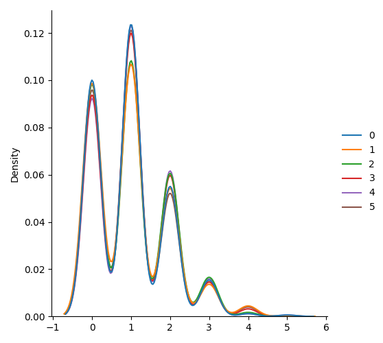

# Data_Science


This **repository** is a cheat sheet how to make various **diograms**, **histograms**, **line**, **bar** or even **pie charts**.

Also, we wiil see a various of **destributions**, like **binomial**, **exponential**, **normal** and so on.
___

## *Files_location*
+ Dio_Histo_grams
  + Bar_Chart.png
  + Double_Bar_Chart.png
  + Histogram.png
  + Pie_Chart.png
  + Range_Diagram.png
  + Scatter-plot.png
+ Line_Charts
  + Double_Area_Chart.png
  + Double_Line_Chart.png
  + Line_Chart.png
+ distribution
  + Binomial_Distribution.png
  + Chi_Square_Distribution.png
  + Exponential_Distribution.png
  + Logistic_Distribution.png
  + Multinomial_Distribution.png
  + Normal_Distribution.png
  + Pareto_Distribution.png
  + Poisson_Distribution.png
  + Rayleigh_Distribution.png
  + Uniform_Distribution.png
  + Zipf_Distribution.png
+ Matplot.py
+ Numpy.py
+ Numpy_random.py
+ Pandas.py
+ Seaborn.py
+ main.py
___

## ***Usage***
### *Pandas*
Start with [Pandas library](https://pandas.pydata.org). **Pandas** is a fast, powerful, flexible and easy to use open source data analysis and manipulation tool, built on top of the Python programming language.

First of all, import [pandas](https://pandas.pydata.org/getting_started.html) in our programm.
```python
import pandas as pd
```

Create a new Table Data Frame with our index by using parameter *"index"* in the DataFrame function. 
```python
# create Table Data Frame
data = {
    'table_data': {
        'ages': [14, 18, 24, 42],
        'heights': [1.65, 1.80, 1.76, 1.88],
        'weight': [45, 60, 82, 65]
    },
    'index_data': ['Katya', 'Egor', 'Eldar', 'Danya']
}
df = pd.DataFrame(data['table_data'], index=data['index_data'])
```

Also, we can **add a new column** in our table like this:
```python
# add a new column (Series)
df['BMI'] = df['weight'] / (df['heights']**2)
```

And finally, print the result to the console:
```python
# get all table
print(f'{df}\n')
```


It's all just a part of this library. There are a lot of commands like **slices the table**, **conditionals**, **grouping**, get **count**, **mean**, **std**, **min**, **max** values and so on.
___

### *Matplotlib*
Second important library is [Matplotlib](https://matplotlib.org). **Matplotlib** is a comprehensive library for creating static, animated, and interactive visualizations in Python.

First of all, import [matplotlib.pyplot](https://matplotlib.org/stable/tutorials/introductory/pyplot.html) and [pandas](https://pandas.pydata.org/getting_started.html) in our programm.
```python
import matplotlib.pyplot as plt
import pandas as pd
```

Then make some information statistic and save it in a dictionary data type.
```python
data = {
    'cases': [130, 140, 148, 160, 165, 172, 177],
    'deaths': [10, 20, 30, 30, 35, 60, 55],
    'months': ['January', 'February', 'March', 'April', 'May', 'June', 'July'],

}
```

After that, we wiil make **table** using library **pandas**. And make index by **'months'** in our table.
```python
df = pd.DataFrame(data, index=data['months'])
```

This is example of **Double Line Chart**:  
```python
# make 2 lines - "cases" and "deaths"
df[['cases', 'deaths']].plot(kind="line", legend=True, color=['#000000', '#FF0000'])

plt.xlabel('Year')  # X axis
plt.ylabel('Number')  # Y axis

plt.suptitle("Death Statistic")  # create title

# save visualization in the folder
plt.savefig('Line_Charts/Double_Line_Chart.png')
```

As the result, we will have this visualization:


___

### *Seaborn*
And of course, the really cool visualization library is [Seaborn](https://seaborn.pydata.org). **Seaborn** is a Python data visualization library based on matplotlib. It provides a high-level interface for drawing attractive and informative statistical graphics.

let`s import [seaborn](https://seaborn.pydata.org/installing.html), [numpy.random](https://numpy.org/doc/stable/reference/random/index.html) and [matplotlib.pyplot](https://matplotlib.org/stable/tutorials/introductory/pyplot.html) in our programm.
```python
import seaborn as sns
from numpy import random
import matplotlib.pyplot as plt
```

With these libraries we will make visualization of different distributions.

As for example, we will make distributions of dice rolling.

We will use three parameters:

n - number of possible outcomes (e.g. 6 for dice roll).

pvals - list of probabilties of outcomes (e.g. [1/6, 1/6, 1/6, 1/6, 1/6, 1/6] for dice roll).

size - The shape of the returned array.

```python
# Visualization of Multinomial Distribution
sns.displot(random.multinomial(n=6, pvals=[1/6, 1/6, 1/6, 1/6, 1/6, 1/6], size=1000), kind="kde")
plt.savefig('distribution/Multinomial_Distribution.png')
```
And get this incredible visualization of **multinomial distribution**:



And this is not the only one distribution what we can visualize. There are Normal, Binomial, Logistic Distributions etc. 
___

### *Numpy*
Last but not least, the library [Numpy](https://numpy.org). **NumPy** offers comprehensive mathematical functions, random number generators, linear algebra routines, Fourier transforms, and more.

And first, import [numpy](https://numpy.org/install/) in our programm.
```python
import numpy as np
```

```python
# create array with float numbers
x = np.array(range(10), float)  # dtype='f'
```

```python
# create two-dimensional array
dm2 = np.array([[1, 2, 3], [4, 5, 6], [7, 8, 9]])
```

```python
# array reshaping
reshape_x = x.reshape((5, 2))
print(x)  # [0. 1. 2. 3. 4. 5. 6. 7. 8. 9.]
print(reshape_x)  # [[0. 1.]
#                   [2. 3.]
#                   [4. 5.]
#                   [6. 7.]
#                   [8. 9.]]
```


## *Example*
When you open the programme you will choose the language you are comfortable with (*ukrainian* or *english*). Also you can choose play game with audio :sound: or without it :mute:. 


The game also features a choice of actions. Where the character goes or what phrase he says.


There are easy and hard levels. If you chose hard difficalty level you will play short games. Also in this level you will have lives :hearts: and if you lose everything, you will automatically lose.


___

## *Mini_games*
*In detective game you have 3 mini games.*
- "Guess the number"
- "Dice rolling"
- "Rock, paper, scissors"

### __"Guess the number"__
It's first game where you should guess the number which computer was guessed.
Here’s what it looks like:


___

### __"Dice rolling"__
This is second game :game_die: where you must roll the dice and sum of the digits must be greater than or equal to 8. Here’s what it looks like:


___

### __"Rock, paper, scissors"__
And there is last game where you should play famous child game "Rock, paper, scissors". I hope you know rules of this game. Here’s what it looks like:


___

## *PyTorch*

And the trump card in my program is the voices of [Silero models](https://github.com/snakers4/silero-models).

With this module you can set more than 100 votes to the character. 

First of all, import [torch](https://github.com/pytorch/pytorch) and [soundfile](https://pypi.org/project/SoundFile/) in our programm.
```python
import torch
import soundfile as sf
```

Then make configuration of character:
```python
language = 'en'
model_id = 'v3_en'
sample_rate = 48000
speaker = 'en_70'  # en_0, en_1, ..., en_117, random
put_accent = True
put_yo = True
device = torch.device('cpu')  # cpu or gpu


model, _ = torch.hub.load(repo_or_dir='snakers4/silero-models',
                          model='silero_tts',
                          language=language,
                          speaker=model_id)

model.to(device)
```
In conclusion, we convert text to speach and save it in _wav_ format.
```python
def author_speak(what: str, n):
    audio = model.apply_tts(ssml_text=what,
                            speaker=speaker,
                            sample_rate=sample_rate,
                            put_accent=put_accent,
                            put_yo=put_yo)

    sf.write(f'vvauthor_say{n}.wav', audio, sample_rate)
```
- First you can open executable file in **detective_game** [archives](https://github.com/Kalinka5/detective_game/tree/main/archives);
- Second you can open any IDE and run *"main"* program in **python_files** [arhives](https://github.com/Kalinka5/detective_game/tree/main/archives).